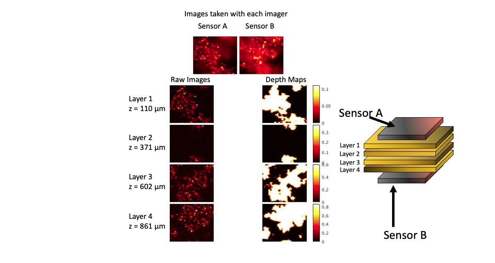

# 3D-Reconstruction-of-Cellular-Images
The goal of the project is to use Deep Neural Networks to deblur, enhance and estimate depth from images taken with a microfabricated lensless customized CMOS image sensor as described in [1-3].

To train the models, a synthetic dataset, representative of images taken with the customized image sensor from real-life cell foci is generated which can be found inside the “Dataset” folder.

To locate the tumor cell foci, a binary matrix is generated to represent a tumor mask with high values (>0.5) indicative of tumor and low values (<0.5) for non-cancerous background. Once the location of the cell foci is determined within the mask, the raw image in generated, and a tumor image is rendered by convolving the war image with the PSF (Point Spread Function) of the custom image sensor that was characterized previously.

The first multi-layer cell detection module is based on a single sensor, observing a stack of 4 layers of cells that are randomly spaced between 0 and 1 mm away from the sensor.
Emulated cell images from 4 different depth values are chosen randomly with a minimum difference of 250 µm from 0 to 1 mm. Initial cell images from each layer are convolved with the PSF of the custom-made imager and added together spatially to form a multilayer image. 

“images_depth”:

This dataset consists of a total of 6 .mat files.
Each .mat file includes 2000 samples with the each datapoint in the following format:
1.	tumorImage_noPSF: (size: 4x51x51)
Individual raw images(masked cell images) of the target in each of the four layers before being convolved with the PSF of the custom image sensor

2.	tumorImage_withPSF_A: (size: 51x51)
The images taken with sensor A on top of the targeted specimen. The image is generated by convolving masked cells from each of the 4 layers with the PSF based on the distance from imager A.  The images resulting from this convolution are added together spatially to construct 1 single image from sensor A.

3.	tumorImage_withPSF_B: (size: 51x51)
The images taken with sensor B underneath the targeted specimen. The image is generated by convolving masked cells from each of the 4 layers with the PSF based on the distance from imager B.  The images resulting from this convolution are added together spatially to construct 1 single image from sensor B. The sharper regions depicted in the image from sensor A appear blurry in the image taken with sensor B. 

4.	depth_map: (size: 4x51x51)
For each layer, a 51x51 depth map image shows the presence of the cells with a pixel value equal to value of the depth (refer to zdist_PSF) and the absence of any cells by setting the pixel to be 0.

5.	zdist_PSF: (size: 1x4)
the distance of each layer from sensor A (1mm-distance from sensor B) is stored in “zdist_PSF” variable

Here’s a sample datapoint from the dataset:

 
References:

[1] 	Papageorgiou, E. P., Boser, B. E. & Anwar, M. Chip-Scale Angle-Selective Imager for In Vivo Microscopic Cancer Detection. IEEE Trans Biomed Circuits Syst 14, 91–103 (2020).

[2] 	Najafiaghdam, H. et al. A Molecular Imaging ’Skin A Time-resolving Intraoperative Imager for Microscopic Residual Cancer Detection Using Enhanced Upconverting Nanoparticles∗. Proceedings of the Annual International Conference of the IEEE Engineering in Medicine and Biology Society, EMBS 2018-July, 3005–3008 (2018).

[3]	Rabbani, R. et al. Towards an Implantable Fluorescence Image Sensor for Real-Time Monitoring of Immune Response in Cancer Therapy. in IEEE Int. Conf. in Engineering in Medicine & Biology Society (EMBC) (2021).

